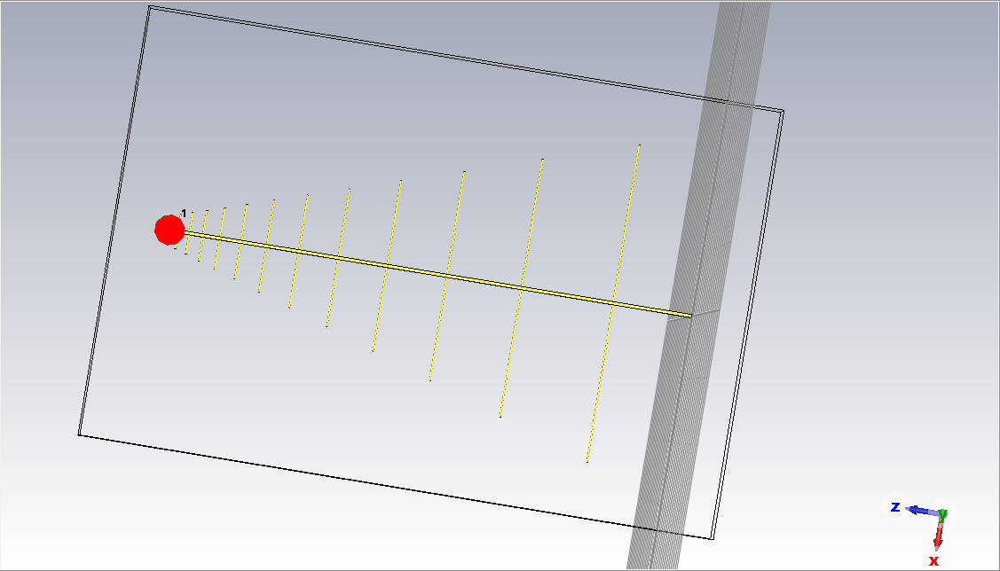
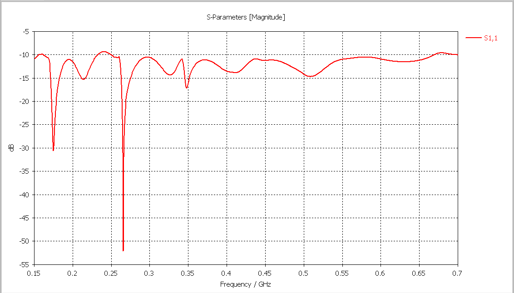
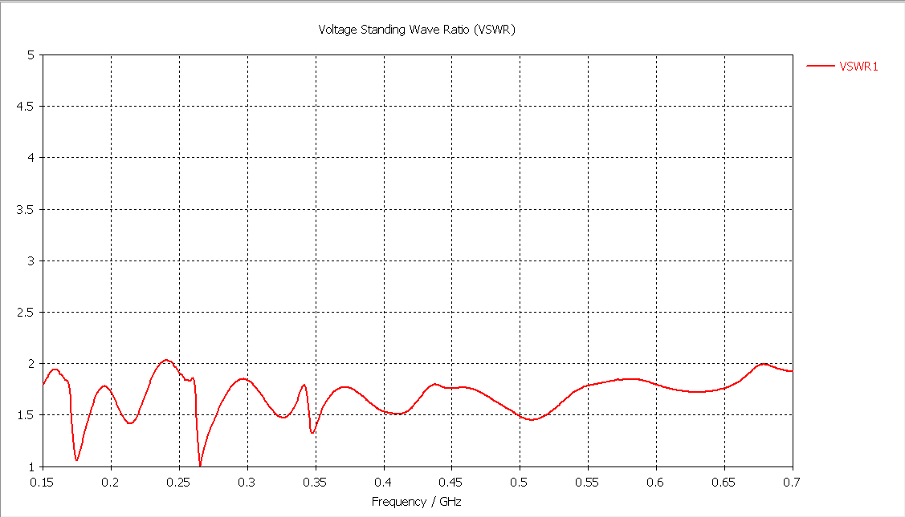
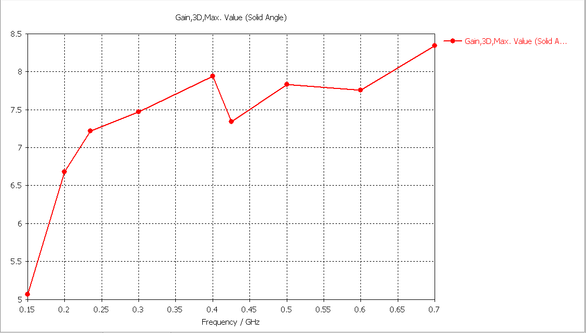
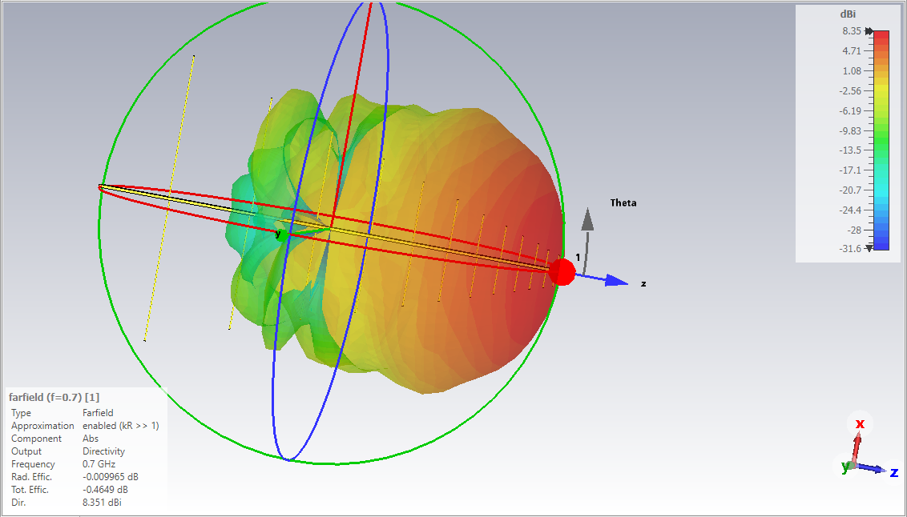
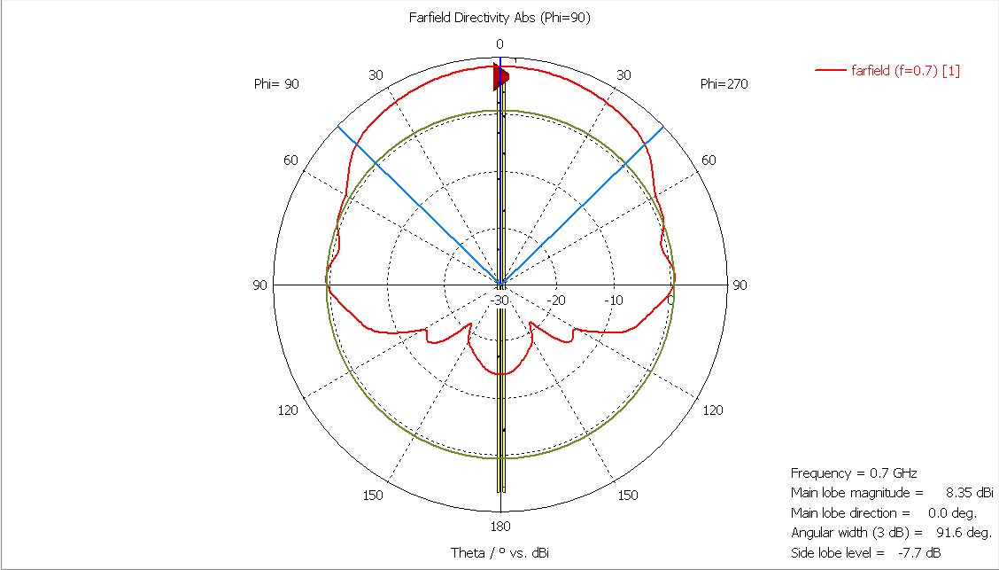

## Antena logarytmiczno - periodyczna do odbioru telewizji naziemnej
W tym repozytorium znajduje się projekt anteny logarytmiczno - periodycznej do odbioru telewizji naziemnej na terenie polski.  
Działa na zarówno na pasma UHF i jak i VHF, co za tym idzie odbierze ona telewizje na każdym możliwym kanale.  
Szerokość pasma wynosi 650 MHz. Antena osiąga WFS poniżej 2 na prawie całej szerokości pasma. Odstępstwa, które występują na małych odcinkach, gdzie WFS wynosi więcej niż 2  
nie wpłyną znacząco na odbiór telewizji.

# Zdjęcia przedstawiające projekt
Model anteny

 
Return Loss   

 
WFS 
 
Tabela przedstawiająca zysk energetyczny dla wybranych częstotliwości  

 
Charakterystyka promieniowania anteny - 3D

 
Charakterystyka promieniowania anteny - na płaszczyźnie
